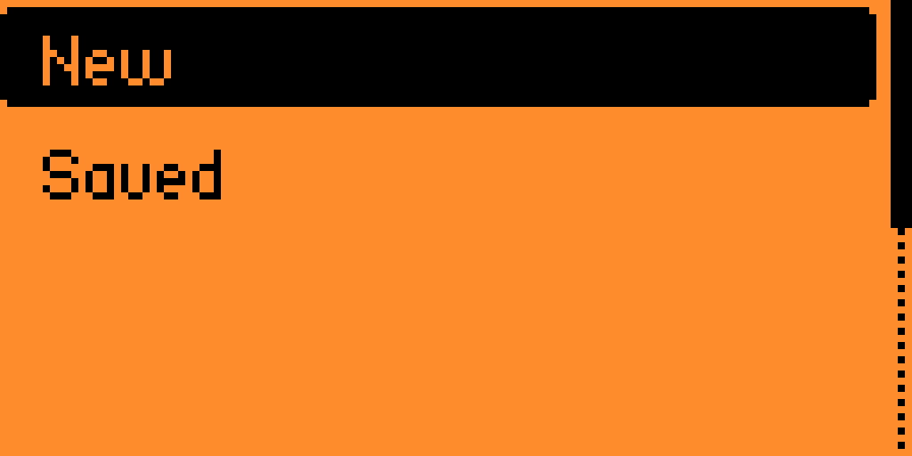

# NFC URL

A Flipper Zero application that generates and emulates NFC tags that point to URLs.

Features:
- Generate http(s), (s)ftp, mailto, etc. URLs
- Save a list URLs for later use
- Export to a Flipper NFC Tag file (.nfc)

## Building & Installation

NFC URL will have GitHub releases and be available (hopefully) on the Flipper App Catalog soon. Until then, build it yourself:

1. Clone this repository.
2. Install [uFBT](https://github.com/flipperdevices/flipperzero-ufbt)
3. Plug in your Flipper and run `ufbt launch` from the project directory.

## Usage

1. Press "New" to create a new NFC Tag

2. Enter your URL
 
3. Emulate your NFC tag
 
4. Save/export the tag to use later
 